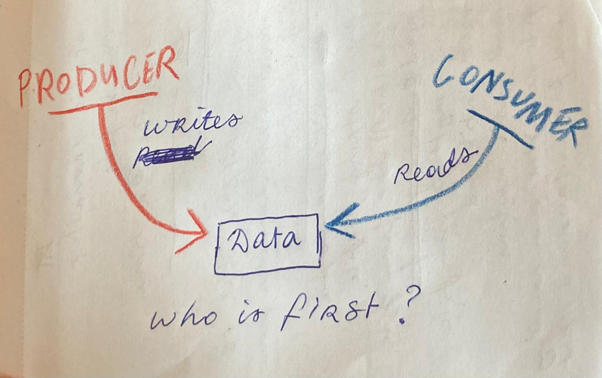

# RACE CONDITIONS
when multiple threads try to access shared data, at same time.  
other term: *synchronization issue*

## Demonstration
```c
#include <unistd.h> //write
#include <pthread.h> //pthread_...

void	delayed_putstr(char *str)
{
	while (*str)
	{
		write(1, &*str, 1);
		str++;
		usleep(100000);
	}
}

void	*slow_typewriter(void *arg)
{
	char *str = (char *)arg;
	delayed_putstr(str);

	return NULL;
}

int	main(void)
{
	pthread_t	thread_1;
	pthread_t	thread_2;

	pthread_create(&thread_1, NULL, slow_typewriter, "DIT IS EEN MOOIE ZIN\n");
	pthread_create(&thread_2, NULL, slow_typewriter, "que sera sera whatever will be.\n");
	pthread_join(thread_1, NULL);
	pthread_join(thread_2, NULL);

	return 0;
}
```

the output should be:  
>**DIT IS EEN MOOIE ZIN**  
>que sera sera whatever will be.  


but the output will be:  
>q**D**u**IT**e  **I**s**S**er a**EE** **N**s e**M**ra**O** **OI**w**E**h a**Z**t**I**e**N**v  
>er will be.  

the computer is trying to "type" the 2 sentences at the same time,  
which results in the scrambled mess.

## Producer-consumer example
one thread (producer) writes data,  
another thread (consumer) reads it.  
if the consumer reads before the producer writes,  
they will get wrong data.
```c
#include <stdio.h> //printf
#include <pthread.h> //pthread...

int	shared_data = 0;

void	*ft_write(void *arg)
{
	shared_data = 666;

	return NULL;
}

void	*ft_read(void *arg)
{
	printf("shared data: %d\n", shared_data);

	return NULL;
}

int	main(void)
{
	pthread_t	producer;
	pthread_t	consumer;

    // both threads start at the same time
	pthread_create(&producer, NULL, ft_write, NULL);
	pthread_create(&consumer, NULL, ft_read, NULL);

	pthread_join(producer, NULL);
	pthread_join(consumer, NULL);

	return 0;
}
```


### 1. A simple solution
change the position of `pthread_join`  
```c
    // Producer starts writing
	pthread_create(&producer, NULL, ft_write, NULL);

    // Wait for producer to finish
	pthread_join(producer, NULL);

    // Consumer starts reading
	pthread_create(&consumer, NULL, ft_read, NULL);

    // Wait for consumer to finish reading
	pthread_join(consumer, NULL);
```

### 2. Mutex
...
