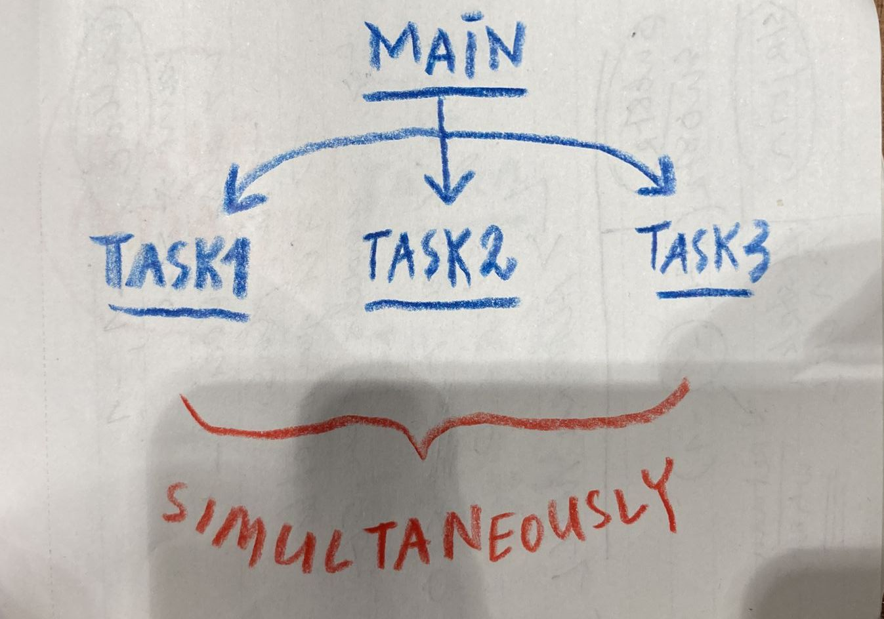

# THREADS
## Single threading (normal)

## Multi threading 
Used for doing multiple things at the **same time**.

## When to use & Why (examples)
### Multi-threaded web server:  
**NO multi-threading:**
Web server handles HTTP request (visitors) one at a time, blocking other visitors.  
**with multi-threading:**
Each HTTP request (visitor) is handled by a seperate thread, simulataneously. So multiple visitors can access the web server at the same time. 

### Optimizing performance.
When u have multiple CPU cores, different threads can run on different CPU cores at the same time. Things get done faster.

## Code
## Edge Cases
