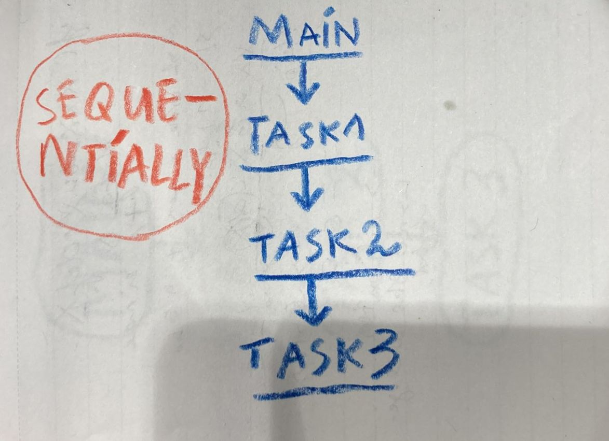

# THREADS
## Single threading (normal)


## Multi threading 
Used for doing multiple things at the **same time**.


## When to use & Why (examples)
### Multi-threaded web server:  
**NO multi-threading:**
Web server handles HTTP request (visitors) one at a time, blocking other visitors.  
**with multi-threading:**
Each HTTP request (visitor) is handled by a seperate thread, simulataneously. So multiple visitors can access the web server at the same time. 

### Optimizing performance.
When u have multiple CPU cores, different threads can run on different CPU cores at the same time. Things get done faster.

## Basics
```c
#include <stdio.h> // printf
#include <pthread.h> // pthread_*

// thread function
void	*function(void *arg)
{
	printf("waddup\n");
	return NULL;
}

int	main(void)
{
	// declare a thread identifier
	pthread_t	cool_thread;

	// create a thread
	pthread_create(&cool_thread, NULL, function, NULL);

	// wait for thread to finish
	pthread_join(cool_thread, NULL);

	return 0;
}
```
program creates 1 thread.  
thread executes a function.  
`pthread_join()` tells the main thread to wait for cool_thread to finish.
## Edge Cases
Error handling. 
pthread_create returns an error code to tell which specific error there is.
```c
int result;
if ((result = pthread_create(...)) != 0)
{
    printf("error creating thread: %d\n", result);
    return 1;
}

if (pthread_join(...) != 0)
{
    printf("error joining thread\n");
    return 1;
}
```
[race conditions](../race_conditions), [deadlock](../deadlock).
